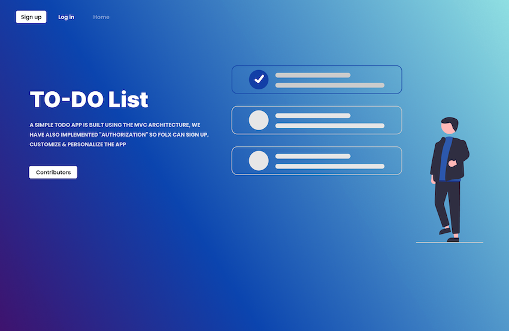

# Noteworthy - Introduction

Noteworthy is a a fully responsive simple to-do application that allows users to create and track their completed and uncompleted to-do tasks.

This project was built using the MVC Architecture and implements user "authorization".
Users are able to sign-up, customize and personalize their to-do lists.

# Functionality

For this project, our team wanted to make sure users could add due dates for their tasks and see a neat and organized list of their finished tasks for a due date once they marked the item as "complete".

# Packages/Dependencies used 

bcrypt, connect-mongo, dotenv, ejs, express, express-flash, express-session, mongodb, mongoose, morgan, nodemon, passport, passport-local, validator

# Screenshots

|home page|contributors|
|:-:|:-:|
|||

<!-- 
 -->

---

# Install all the dependencies or node packages used for development via Terminal

`npm install` 

---

# Things to add

- Create a `.env` file and add the following as `key: value` 
  - PORT: 2121 (can be any port example: 3000) 
  - DB_STRING: `your database URI` 
 ---
 
 ---

# Contributors

- [Rachel](https://github.com/RachFairchild)
- [Amy](https://github.com/ApplePieAngel)
- [Eno](https://github.com/codEno12)
- [Ali](https://github.com/AliReza1083)
- [Bonnie](https://github.com/MissGin)
- [Daniel](https://github.com/CodingWithDan)
- [Meghann](https://github.com/meghannfh)
- [Leonie](https://github.com/lmiddeke)

 ---
 
 Have fun testing and improving it! 😎

