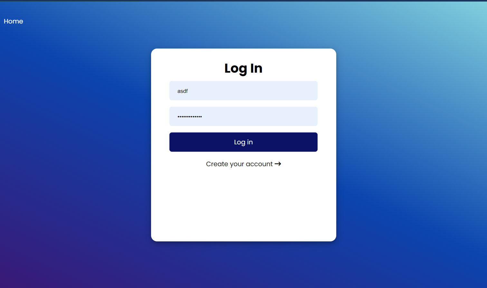

# Noteworthy

Noteworthy is a a fully responsive, lightweight application that allows users to create and track their completed and uncompleted tasks.

This project was built using the MVC Architecture and implements user authorization.
Users are able to sign-up, customize and personalize their tasks and lists.

# Functionality

Users are able to add a due date for their tasks and will be automatically sorted based on the soonest approaching date.
Once created, the item will appear under the list of tasks that have yet to be completed.
Users can either mark a task as "completed" or delete the task from their list.
Any finished tasks will appear in the user's completed task list.

# Packages/Dependencies used 

bcrypt, connect-mongo, dotenv, ejs, express, express-flash, express-session, mongodb, mongoose, morgan, nodemon, passport, passport-local, validator

# Screenshots

|home page|contributors sidebar|
|:-:|:-:|
|||

|sign up|login|
|:-:|:-:|
|||

|without tasks|with todo/completed tasks|
|:-:|:-:|
|||

---

# Install all the dependencies or node packages used for development via Terminal

`npm install` 

---

# Things to add

- Create a `.env` file and add the following as `key: value`
  - PORT: 2121 (can be any port example: 3000) 
  - DB_STRING: `your database URI` 
 ---
 
 ---

# Contributors

- [Rachel](https://github.com/RachFairchild)
- [Amy](https://github.com/ApplePieAngel)
- [Eno](https://github.com/codEno12)
- [Ali](https://github.com/AliReza1083)
- [Bonnie](https://github.com/MissGin)
- [Daniel](https://github.com/CodingWithDan)
- [Meghann](https://github.com/meghannfh)
- [Leonie](https://github.com/lmiddeke)

 ---
 
 Have fun testing and improving it! 😎

